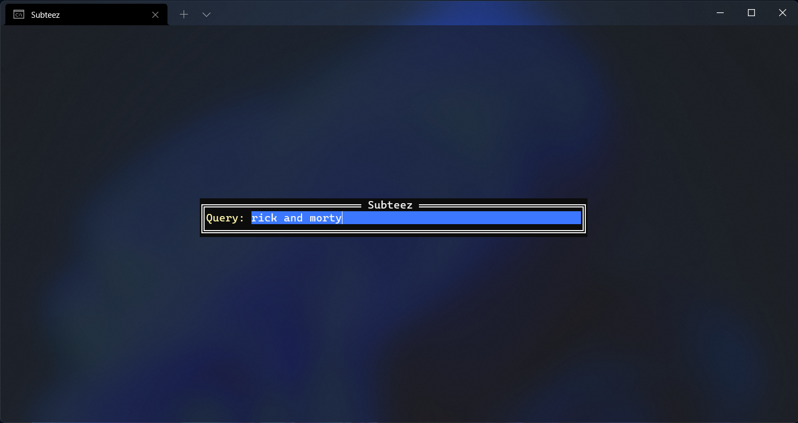
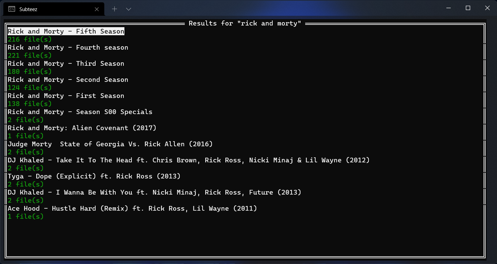
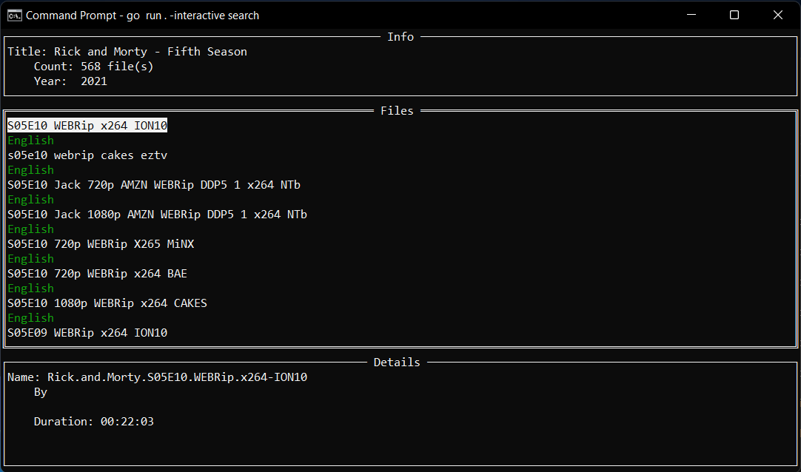

# Subteez Console
This is a console version of [Subteez App](https://play.google.com/store/apps/details?id=madamin.subtitles).
You can use it to search and download subtitles from [Subteez server](https://github.com/minusium/subteez-subscene-proxy).

# Screenshots
* Interactive Mode:







# Usage

```
Usage: subteez [-help | -interactive] <Command> <Arguments>

Options:

    -help [command] : Show help message

    -interactive    : Enable interactive mode

    -script         : Enable script mode
                      Script mode disables log and formats output for using in scripts

Commands:

    config      : Change configuration

    search      : Search for movie or series titles

    files       : List all available subtitle files

    download    : Download a subtitle file

```

## Examples:

* Use interactive mode:
```
> subteez -interactive search

> subteez -interactive search arcane

```

* Search and download subtitles for "Arcane: League of Legends" series:
```
> subteez search arcane
Title: Arcane: League of Legends - First Season (366 files)
ID:    arcane-league-of-legends-first-season

> subteez files arcane-league-of-legends-first-season
ID:       2625728
Language: English
Title:    Arcane Season 01
Author:   NguyenBich

> subteez download arcane-league-of-legends-first-season English 2625728

00:00:00 requesting page "/subtitles/arcane-league-of-legends-first-season/english/2625728" from server

00:00:04 file "arcane-league-of-legends-first-season_HI_english-2625728.zip" saved

```

* Set interactive mode to enable 
```
> subteez config set interactive true

```

* Print subtitle file content to console
```
> subteez download arcane-league-of-legends-first-season en 2625728 | zcat
1
00:00:19,375 --> 00:00:23,125
[foreboding music plays]

2
00:00:29,000 --> 00:00:32,375
[woman vocalizing]

3
00:00:39,541 --> 00:00:42,250
[water gurgles]

4
00:00:43,250 --> 00:00:45,458
[Silco] <i>Ever wonder
what it's like to drown?</i>

```
